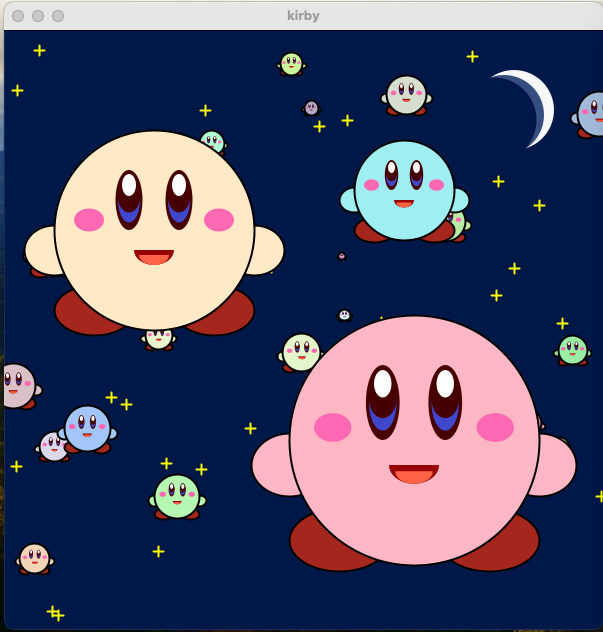

# 경희대학교 강좌 - 코딩하는 아티스트 개인 소스 자료

## 개인 게임 캐릭터 그리기 (kirby)

## 조원들 캐릭터 병합 및 움직임 구현

## 장애물 피하기 게임 v1

## 장애물 피하기 게임 v2 (villain끼리 충돌 활성화)

    <HW3 UI 구현 계획>

    - Player(maru), Villains(gear, blueKirby, pinkyKirby)로 구상.
    - 화면 사이즈 정방형 800. size(800, 800)
    - 초기값 세팅. initConfigs()
    - 배경값 backgroundColor 설정하여 이후 변환
    - 캐릭터 화면 이탈 방지. handleWallCollision()
    - 화면 우측 상단에 초 단위 시간 표시. “score: “+ seconds + “sec”의 형태. renderHeader()
    - 배경 색상 2초 단위 변화. renderHeader()
    - text 색상(Avoid villains with W,A,S,D!) 2초 단위 변화. renderHeader()
    - gameOver 상태 이전까지 Villains와 Player 캐릭터 이동 가능.
    - 기본조작 키보드(W, A, S, D) 사용하여 Player이 5단위 이동. keyPressed()
    - Player과 Villains이 충돌 시 gameOver 상태로 변화. detectCollision()
    - gameOver 상태는 다음과 같이 구상. 배경 색상 변화, “score: “+ seconds + “sec”형태의 점수 표시, 중앙에 “Congratulations!” text 표시. renderOutro()
    - 게임 retry를 위한 마우스 클릭 사용. mousePressed()
